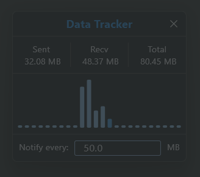
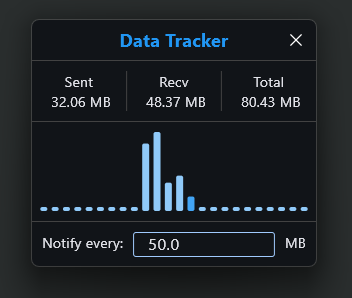

# Data Tracker

A lightweight desktop widget built with [Flet](https://flet.dev/) that displays real-time network data usage. It floats on top of all windows and provides live tracking of data consumption since midnight, including hourly usage graphs and notifications.

## Features

- **Real-time Tracking**: Monitors network data usage (sent/received) since midnight.
- **Hourly Graph**: Visual bar chart showing data usage per hour of the day.
- **Always-on-Top**: Floats above all other windows for constant visibility.
- **Notifications**: Alerts when a configurable amount of data (in MB) has been consumed.
- **Persistent Storage**: Saves usage data across restarts.
- **Minimal UI**: Compact design with opacity changes on hover.

## Screenshots

### Transparent (default state)



### Opaque (on hover)



## Requirements

- Python 3.8+
- Windows (current release target)

## Running the Application

### For End-Users (Windows)

1. Download the latest `Data Trakcer.exe` from the [Releases](https://github.com/baebranch/data-tracker/releases) page.
2. Double-click the `.exe` to run. No installation required.
3. The widget will appear and start tracking your network data usage.

### For Developers

1. Clone the repository:

   ```bash
   git clone https://github.com/baebranch/data_tracker.git
   cd data-tracker
   ```

2. Create a virtual environment:

   ```bash
   python -m venv .venv
   .\.venv\Scripts\activate
   ```

3. Install dependencies:

   ```bash
   pip install -r requirements.txt
   ```

4. Run the application:

   ```bash
   python main.py
   ```

## Building

Use the VS Code task "Build with Flet" or run:

```bash
flet pack main.py --name "Data Tracker" --icon favicon.ico
```

This creates a standalone executable using PyInstaller.

## Usage

- The widget appears as a small window showing current data usage.
- Hover to make it fully opaque.
- Data resets at midnight.
- Hourly bars update in real-time, with the current hour highlighted.

## Configuration

- Notification threshold: Currently hardcoded; modify `main.py` to customize.
- Window position and size: Adjustable in `main.py`.

## Development

- Uses Flet for cross-platform UI.
- Hot reload available via VS Code debug configuration.
- Data stored in `data/network_data.json`.

## License

MIT License - see [LICENSE](LICENSE) for details.
